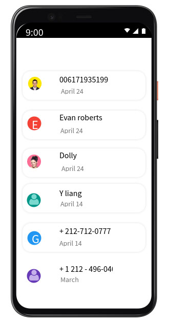
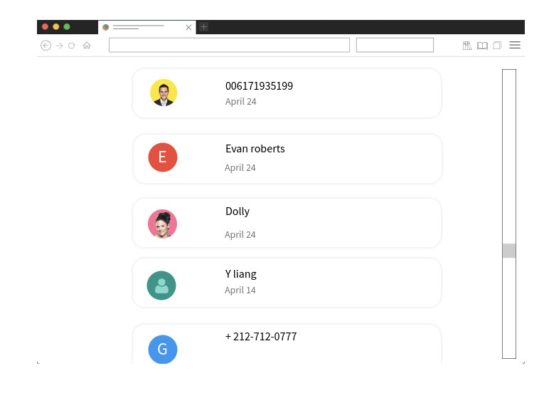
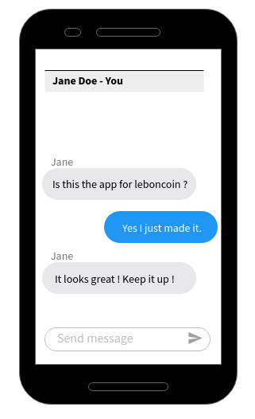
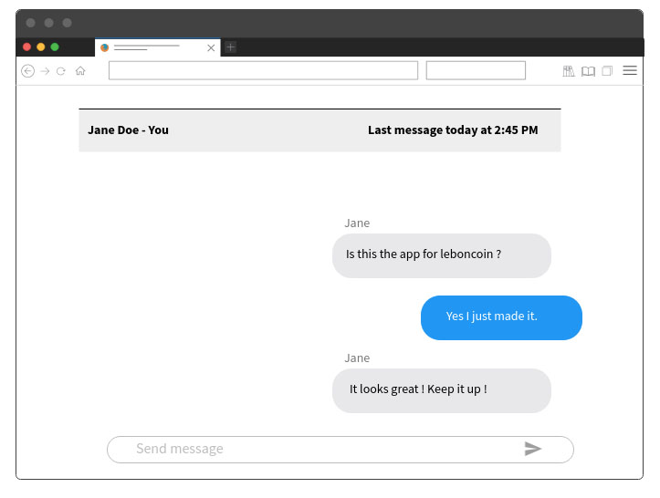

# Returning the tests and explanations

There is my implementation to your test. I made it aproximatively in 6 hours.

I have to explain my working conditions and why I spent lot of time: 
First of all I started to work on the afternoon, thought I could be quiet to do the test. But I wasn't, I can explain it during a call.
Secondly, I never worked on NextJS, so I had to read the documentations, try to run it firstly on Docker but I had some configuration troubles then directly on my laptop. I also had some trouble with API requests I could explain it during a call.
Then, I was really rusted with Typescript, because of a really short experience, but I wanted to to it with TS, to proof to me and maybe you, I able to get new competences even during a test.

I send this test even if it is not really complete, but because of the time alrealdy spend, I assume to send it as is.

I wanted to add three things : 
- integrations tests with react-testing library
- unit tests for utils functions, directly with jest
- On the conversations page, adding a button wich open a layer to create a new conversation with the possibility to select a recipient user, after creating the new conversation, the user is redirected to it.

I tried to do something as simple as possible :
- An API folder to request conversations, messages and users
- Some components targeted on the business 
- Two utilities, one to generate colors and another one to format timestamps to date
- 4 pages : Conversations, Conversation (by ID), NotFound (a little bit ugly, need to be improved)

I also used Styled Components instead of SCSS or CSS or other style preprocessor because I think it is easier to pass props and by the way a behavior

I didn't focus my development on SEO because of the context of this test, but It could be possible to add semantic tags, meta data, etc.

I hope this test will satisfy your waitings
-----

# Context :

At leboncoin, our users can share messages about a transaction, or ask for informations about any products.

Your job is to create the interface to consult those messages.
The interface needs to work on both desktop & mobile devices.

In addition to your code, a README explaining your thought process and your choices would be appreciated.

# Exercise :

- Display a list of all the conversations
- Allow the user to select a conversation
  - Inside the conversation, there is a list of all the messages between these two users.
  - As a user, you can type and send new messages in this conversation

**As your application can be used by millions of users, make sure to provide some robust safety guards.**

### Sketches :

Obvisouly, it is up to you to make something nice and pretty, you are free to design it the way you like. The sketches are here to give you an idea on how it should look.

  
Click to see the sketches

  
Mobile list :

Desktop list :

Mobile conversation :

Desktop conversation :

### API :

You can find the API swagger file in `docs/api-swagger.yaml`.

For a better readibility, you can view it on [https://leboncoin.tech/frontend-technical-test/](https://leboncoin.tech/frontend-technical-test/).

---

## Bonus 1 :

We provide some conversation samples, but can you improve the app so the user can now create new conversations ?

## Bonus 2 :

Our infrastructure is a bit shaky.. Sometimes the servers are crashing. “It’s not you, it’s me”, but maybe you can display something nice to warn the user and handle it gracefully.

## Do you want to make the app even better ?

Feel free to make as many improvements as you like.
We love creativity and technical challenges.

If you are out of ideas, here are some thoughts :

- As we want to reach our users anywhere, we need to make sure the app is performing well. What can you do to make it really fast ?

- Our goal is to support everybody in the country, including people with disabilities. As a good citizen and a good developer, can you make sure the app is accessible for everyone ?

- We all love to relax after a hard day’s work. It would be a shame if we didn’t feel confident enough about the upcoming automatic deployment. Are you sure everything has been tested thoroughly ?
